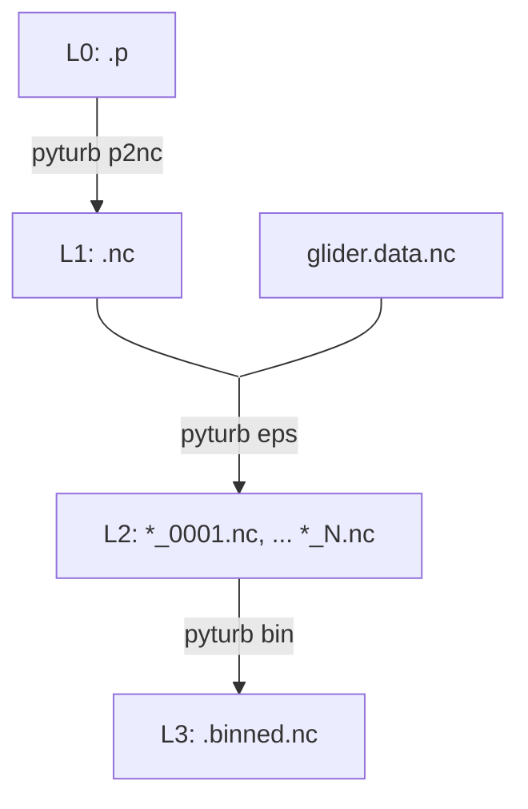

# pyturb

A microstructure processing toolbox for Rockland Scientific microstructure instruments.

## Installation

Install using `pip`. 

## Usage



Pyturb is primarily a CLI. The processing should be run in the following order:

1. Convert p files to netCDF using `pyturb p2nc`. Optionally, merge converted p files with `pyturb merge`.
2. Calculate turbulence estimates per-profile using `pyturb eps`.
3. Bin estimates onto a regular grid with `pyturb bin`.

### `p2nc` - convert P files

Convert Rockland binary P-files to NetCDF format:

```bash
pyturb p2nc ./path/to/raw_data/*.p -o ./converted/
```

Note that unlike the ODAS toolbox, this conversion does not apply a velocity scaling to the microstructure shear or temperature gradient. The units of these variables are different to their ODAS counterparts. The scaling is applied later.

The merge utility enables merging of netcdf files (e.g. `pyturb merge -o ./merged/merged.nc ./converted/*.nc`). This may be useful in the case where profiles are split across multiple files. 

### `eps` - calculate the dissipation rate

Estimate turbulent kinetic energy dissipation rate from converted NetCDF files:

```bash
pyturb eps ./converted/*.nc -o ./eps_output/
```

The `eps` command automatically detects multiple profiles within each input file. Output files are named `{input_stem}_p{NNNN}.nc`. Data from other instruments may be merged at this step to improve the calculations. For example, temperature and salinity may be merged from a Slocum glider and used to esimate viscosity. Velocity from a calibrated glider flight model may also be specified.

A selection of the option used:
- `--diss-len`: Dissipation window length in seconds (default: 4.0)
- `--fft-len`: FFT segment length in seconds (default: 1.0)  
- `--min-speed`: Minimum speed threshold in m/s (default: 0.2)
- `--direction`: Profile direction to process: `down`, `up`, or `both` (default: down)
- `--peaks-height`: Minimum peak height for profile detection in dbar (default: 25.0). Relies on [profinder](github.com/oceancascades/profinder.git)
- `--aux`: Auxiliary NetCDF file with glider flight data (lat, lon, T, S)
- `--thermo`/`--no-thermo`: Compute Conservative Temperature, Absolute Salinity, and potential density (referenced to 0 dbar) via `gsw` when temperature and salinity are available (default: off). Uses lat/lon from `--aux` if provided, otherwise a default position (45°N, 0°E).

See `pyturb eps --help` for details. 

Example processing just up casts:
```bash
pyturb eps -o ./eps_output/ --direction up ./converted/*.nc
```

### `bin` - bin average the data

Bin epsilon estimates by depth and concatenate into a single file:

```bash
pyturb bin -o binned_profiles.nc --bin-width 2.0 --dmax 500 ./eps_output/*.nc
```

Options:
- `--bin-width`: Depth bin width in meters (default: 2.0)
- `--dmin`/`--dmax`: Depth range for binning (default: 0-1000 m)
- `--pressure`: Bin by pressure instead of depth

`absolute_salinity`, `conservative_temperature`, and `potential_density` are included in the binned output by default whenever they exist in the input files (i.e., `eps` was run with `--thermo`).

## Methods

### Preprocessing

Before computing epsilon, profiles undergo:

1. Low-pass filtering of speed (or dP/dt-derived speed) to remove high-frequency noise.
2. Shear signals are scaled by 1/U^2 and temperature gradients by 1/U to convert to physical units.
3. Iterative removal of outliers from shear and temperature gradient signals using a form of median filter.

### Shear spectrum processing

The dissipation rate is estimated by fitting shear spectra to the Nasmyth spectrum:

1. Spectra are calculated using Welch's method with overlapping FFT windows. 
2. Spectra are converted to wavenumber spectra assuming Taylor's frozen turbulence hypothesis using the mean velocity over the window.
3. Single-pole transfer functions are used to correct spatial averaging of the shear probe and anti-aliasing filter.
4. Epsilon is estimated by fitting the observed spectrum to the theoretical Nasmyth spectrum in the inertial subrange
5. Unresolved high-wavenumber variance is accounted for using the integrated Nasmyth spectrum
6. Quality control metrics including mean absolute deivation are computed and QC flag attached. 

# Compute epsilon
batch_compute_epsilon('./converted/*.nc', output_dir='./eps/', diss_len_sec=4.0)

# Bin profiles
bin_profiles('./eps/*.nc', output_file='binned.nc', bin_width=2.0)
```
