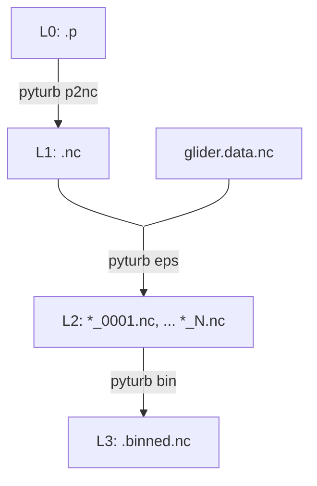

# pyturb

A microstructure processing toolbox for Rockland Scientific microstructure instruments.

## Installation

Install using `pip`. 

## Usage



Pyturb is primarily a CLI. The processing should be run in the following order:

1. Convert p files to netCDF using `pyturb p2nc`. Optionally, merge converted p files with `pyturb merge`.
2. Calculate turbulence estimates per-profile using `pyturb eps`.
3. Bin estimates onto a regular grid with `pyturb bin`.

### `p2nc` - convert P files

Convert Rockland binary P-files to NetCDF format:

```bash
pyturb p2nc ./path/to/raw_data/*.p -o ./converted/
```

Note that unlike the ODAS toolbox, this conversion does not apply a velocity scaling to the microstructure shear or temperature gradient. Consequently, the units of these variables are different to their ODAS counterparts. The scaling is applied later.

The merge utility enables merging of netcdf files (e.g. `pyturb merge -o ./merged/merged.nc ./converted/*.nc`). This may be useful in the case where profiles are split across multiple files and per-file processing would result in incomplete profiles.

Each converted variable also carries the setup-string calibration parameters actually used for it, as `cal_<key>` attrs (e.g. `T1.attrs["cal_t_0"]`, `T1.attrs["cal_beta_1"]`) -- easier to consume downstream than re-parsing the full embedded `pfile_configuration` string. Thermistor channels (`T1`, `T2`) additionally retain their raw ADC counts (`T1_counts`, `T2_counts`) alongside the usual physical-unit output, since the FP07 conversion's internal `Z` clip means the converted value can saturate; the raw counts let `calibrate-fp07` (below) rebuild a corrected signal exactly, without needing to reconvert from the original `.p` file.

### `calibrate-fp07` - recalibrate FP07 thermistor probes (optional)

The embedded FP07 calibration coefficients (`T_0`, `beta_1`, `beta_2`) are usually uncalibrated default values. `calibrate-fp07` fits corrected coefficients in situ against a reference (e.g. `JAC_T`) and rebuilds `gradT1`/`gradT2`.

```bash
# Fit from one representative profile; writes a report with old-vs-new
# parameters and old-vs-new agreement with the reference.
pyturb calibrate-fp07 fit converted/RIOT_VMP194_0003.nc --profile 0 -o cal.yaml

# Apply that fit to every converted file from the same instrument with a
# matching probe serial number. Files that don't match both are skipped.
pyturb calibrate-fp07 apply cal.yaml converted/RIOT_VMP194_*.nc -o converted_calibrated/

# Or do both at once across a whole dataset: scans the input files, groups
# them by (instrument, probe serial number), fits each group from a
# representative profile in the file nearest the middle of that group, and
# applies every fit to every matching file.
pyturb calibrate-fp07 auto converted/*.nc -o converted_calibrated/ -r cal.yaml
```

`--profile` is 0-based and matches `eps`'s `_p{NNNN}` output numbering, so `--profile 0` corresponds to what would become `..._p0000.nc`. Run `pyturb calibrate-fp07 fit`/`apply`/`auto --help` for all options.

### `eps` - calculate the dissipation rate

Estimate turbulent kinetic energy dissipation rate from converted NetCDF files:

```bash
pyturb eps ./converted/*.nc -o ./eps_output/
```

The `eps` command automatically detects multiple profiles within each input file. Output files are named `{input_stem}_p{NNNN}.nc`. Data from other instruments may be merged at this step to improve the calculations. For example, temperature and salinity may be merged from a Slocum glider and used to esimate viscosity. Velocity from a calibrated glider flight model may also be used.

A selection of the option:
- `--diss-len`: Dissipation window length in seconds (default: 4.0)
- `--fft-len`: FFT segment length in seconds (default: 1.0)  
- `--min-speed`: Minimum speed threshold in m/s (default: 0.2)
- `--direction`: Profile direction to process: `down`, `up`, or `both` (default: down)
- `--peaks-height`: Minimum peak height for profile detection in dbar (default: 25.0). Relies on [profinder](github.com/oceancascades/profinder.git)
- `--aux`: Auxiliary NetCDF file with platform data (e.g. glider lat, lon, T, S)
- `--thermo`/`--no-thermo`: Compute additional thermodynamic variables with gsw, including potential density and buoyancy frequency.
- `--chi`/`--no-chi`: Compute the dissipation rate of temperature variance (`chi_1`, `chi_2`) from the microstructure temperature gradient probes (default: on).
- `--match-conductivity`/`--no-match-conductivity`: Apply lag corrections for conductivity and temperature.
- `--skip-existing`/`--no-skip-existing`: Skip a file entirely if any output already exists for its stem. Ignored with `--overwrite`.
- `--vmp-style-gps`/`--no-vmp-style-gps`: Use one lat/lon per profile (a single ship/surface GPS fix per cast) instead of interpolating a continuously-tracked position onto every window/bin. Default: auto-detected from the p-file's `vehicle` field (`vmp`/`rvmp`/`xmp` are treated as VMP-style; anything else is treated as continuously tracked, e.g. gliders). With VMP-style GPS, `lat`/`lon` are written as dimensionless scalars (the position at the profile's first timestamp); with a continuously-tracked position they vary with `time`/`ctd_time`.

CTD scalars (pressure, temperature, salinity, conductivity, density, and the individual FP07 thermistors `T1`/`T2`) can be attached to a finer `ctd_time` axis (`*_hires` variables, e.g. `temperature_hires`, `T1_hires`), alongside the dissipation-bin versions. Bin width is set by `ctd_bin_sec`. Pass `ctd_bin_sec=0` to disable.

See `pyturb eps --help` formore details. 

Example processing just up casts:
```bash
pyturb eps -o ./eps/ --direction up ./converted/*.nc
```

### `bin` - bin average the data

Bin epsilon estimates by depth and concatenate into a single file:

```bash
pyturb bin -o binned_profiles.nc --bin-width 2.0 --dmax 500 ./eps_output/*.nc
```

A selection of the option:
- `--bin-width`: Depth bin width in meters (default: 2.0)
- `--dmin`/`--dmax`: Depth range for binning (default: 0-1000 m)
- `--ctd-bin-width`: Also bin the higher-resolution CTD variables (see `eps` above) onto a separate, typically finer grid of this width, on a separate `ctd_depth` coordinate (default: off)

Profiles are concatenated along a `profile` dimension and sorted chronologically.

## Methods

### Preprocessing

Before computing epsilon, profiles undergo:

1. Low-pass filtering of speed (or dP/dt-derived speed) to remove high-frequency noise.
2. Shear signals are scaled by 1/U^2 and temperature gradients by 1/U to convert to physical units.
3. Iterative removal of outliers from shear and temperature gradient signals using a form of median filter.

### Shear spectrum processing

The dissipation rate is estimated by fitting shear spectra to the Nasmyth spectrum:

1. Spectra are calculated using Welch's method with overlapping FFT windows. 
2. Spectra are converted to wavenumber spectra assuming Taylor's frozen turbulence hypothesis using the mean velocity over the window.
3. Single-pole transfer functions are used to correct spatial averaging of the shear probe and anti-aliasing filter (Rockland Technical Note 026).
4. Epsilon is estimated by fitting the observed spectrum to the theoretical Nasmyth spectrum in the inertial subrange.
5. Unresolved high-wavenumber variance is accounted for using the integrated Nasmyth spectrum.
6. Quality control metrics including mean absolute deivation are computed and QC flag attached. 

### Temperature gradient spectrum processing

With `--chi`, the dissipation rate of temperature variance is estimated from the FP07 temperature gradient spectra:

1. Spectra are corrected for the thermistor frequency response using a single-pole transfer function with a speed-dependent time constant (Lueck).
2. Chi is computed by integrating the corrected spectrum over the resolved wavenumber band, with the upper limit set by the anti-alias cutoff, the spectral noise minimum, and the 95%-variance wavenumber.
3. Epsilon is taken as the per-window combination of the shear-probe estimates (mean if within a factor of 10, minimum otherwise), fixing the Batchelor wavenumber.
4. Unresolved variance is corrected using the closed-form integral of the Kraichnan spectrum.
5. Molecular thermal diffusivity is computed from an empirical conductivity formula (Caldwell 1974).
6. A figure of merit against the Kraichnan spectrum and a QC flag are attached, mirroring the epsilon QC.
